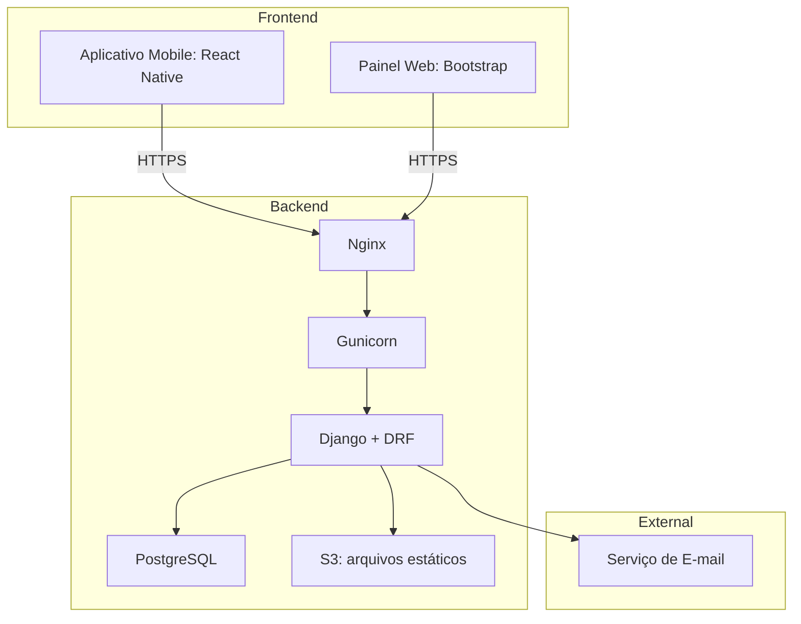

# Janu Prime

**1. Visão Geral**

Janu Prime é uma plataforma digital que visa a fidelização de clientes através de um programa de pontos gerado a partir do consumo em estabelecimentos parceiros de Januária-MG. Os pontos acumulados pelos clientes podem ser convertidos em produtos, serviços ou descontos, incentivando o consumo local e promovendo o fortalecimento da economia regional.

**Objetivo principal:**
Impulsionar a economia local por meio de uma plataforma colaborativa de marketing e fidelização que conecta clientes a comércios locais, recompensando o consumo com benefícios.

**Público-alvo:**

- Estabelecimentos comerciais de Januária e região.
- Consumidores da cidade que desejam obter vantagens ao consumir localmente.

**Problema que resolve:**

- Baixa fidelização de clientes.
- Baixa visibilidade e integração dos comércios locais.
- Dificuldade de pequenos comércios em competir com grandes redes e e-commerce.

---

**2. Componentes Principais e Tecnologias Utilizadas**

- **Frontend Mobile:** React Native (aplicativo mobile multiplataforma)

- **Frontend Web:** HTML, CSS, JavaScript e Bootstrap (painel administrativo para lojistas)
- **Backend:** Django + Django REST Framework
- **Banco de Dados:** PostgreSQL
- **Hospedagem:** AWS (camadas gratuitas)
- **Servidor Web:** Nginx
- **Servidor de aplicação:** Gunicorn
- **Autenticação:** JWT
- **APIs externas:** Envio de e-mails

**Justificativa das escolhas:**

- Stack madura, bem documentada e com suporte a escalabilidade.
- Django facilita a manutenção e implementação rápida com boa segurança.
- React Native permite entrega rápida de apps para Android/iOS.

---

**3. Diagrama de Componentes (Arquitetura Geral)**



---

**4. Estrutura do Projeto (Planejada)**

```
app/
├── core/            # App para lógicas centrais, modelos base, etc.
├── usuarios/        # Gestão de Clientes, Administradores, autenticação.
├── estabelecimentos/# Cadastro e gestão de estabelecimentos e seus dados.
├── produtos/        # Catálogo de produtos/recompensas.
├── transacoes/      # Lógica para Tickets de crédito e débito, extratos.
├── avaliacoes/      # Gestão de avaliações da plataforma e dos estabelecimentos.
├── anuncios/        # Gestão de banners promocionais e anúncios.
├── logs/            # Logs e auditoria.
├── config/          # Configurações globais da plataforma.
```

---

**5. Casos de Uso (Planejados)**

UC01 - Cadastro de Cliente
UC02 - Acúmulo de Pontos por Nota Fiscal
UC03 - Resgate de Pontos por Produtos
UC04 - Cadastro de Estabelecimento (Admin)
UC05 - Gerenciamento de Produtos (Estab.)
UC06 - Aprovação de Tickets (Funcionário)
UC07 - Avaliar Estabelecimento/Plataforma
UC08 - Visualização de Saldo e Extrato de Pontos
UC09 - Login e Recuperação de Senha
UC10 - Cadastro e Gestão de Anúncios
UC11 - Consulta de Estabelecimentos
UC12 - Visualizar Métricas da Plataforma (Admin)
UC13 - Auditoria e Logs (Admin)
UC14 - Gerenciar Funcionários
UC15 - Gerenciar Perfil do Estabelecimento

```mermaid
graph TD
    subgraph "Atores"
        Cliente
        Funcionario
        AdminEstabelecimento["Admin do Estabelecimento"]
        AdminPlataforma["Admin da Plataforma"]
    end

    AdminPlataforma --> UC04["UC04: Cadastrar/Gerenciar Empresas"]
    AdminPlataforma --> UC12["UC12: Visualizar Métricas da Plataforma"]
    AdminPlataforma --> UC13["UC13: Auditoria Geral"]

    AdminEstabelecimento --> UC14["UC14: Gerenciar Funcionários"]
    AdminEstabelecimento --> UC15["UC15: Gerenciar Perfil do Estabelecimento"]

    Funcionario --> UC10["UC10: Gerenciar Anúncios"]
    Funcionario --> UC05["UC05: Gerenciar Produtos"]
    Funcionario --> UC06["UC06: Aprovar/Recusar Tickets"]

    Cliente --> UC01["UC01: Cadastro e Gestão de Conta"]
    Cliente --> UC02["UC02: Enviar Nota Fiscal (Crédito)"]
    Cliente --> UC03["UC03: Resgatar Produto (Débito)"]
    Cliente --> UC08["UC08: Ver Saldo e Extrato"]
    Cliente --> UC07["UC07: Avaliar Estabelecimento/Plataforma"]
    Cliente --> UC11["UC11: Consultar Estabelecimentos"]
    Cliente --> UC09["UC09: Login e Recuperação de Senha"]
```


