[Visão Geral](/README.md) | [Diagrama De Classes](/docs/diagrama_classes.md) | [Fluxo de Requisições](/docs/fluxo_requisicao.md) | [Endpoints](/docs/endpoints.md)

---
### Diagrama Entidade - Relacionamento (Planejado)

**Tabelas:**

- `clientes`
- `administradores`
- `estabelecimentos`
- `produtos`
- `ticket_credito`
- `ticket_debito`
- `avaliacoes_estabelecimento`, `avaliacoes_plataforma`
- `logs`, `anuncios`, `config`

```mermaid
    erDiagram
        adm_plataforma {
            INT id
            STRING nome
            STRING email
            STRING senha
            STRING cpf
            DATETIME created_at
            DATETIME updated_at
        }
        administradores {
            INT id PK
            INT estabelecimento_id FK
            STRING nome
            STRING email
            STRING senha
            STRING cpf
            BOOLEAN ativo
            BOOLEAN super_user
            DATETIME created_at
            DATETIME updated_at
        }
        clientes {
            INT id PK
            STRING nome
            STRING email
            STRING senha
            STRING cpf
            STRING telefone
            INT pontos
            DATETIME created_at
            DATETIME updated_at
        }
        avaliacoes_estabelecimento {
            INT id PK
            INT cliente_id FK
            INT estabelecimento_id FK
            INT estrelas
            STRING descricao
            DATETIME created_at
            DATETIME updated_at
        }
        avaliacoes_plataforma {
            INT id PK
            INT cliente_id FK
            INT estrelas
            STRING descricao
            DATETIME created_at
            DATETIME updated_at
        }
        estabelecimentos {
            INT id PK
            STRING nome
            STRING endereco
            STRING telefone
            STRING descricao
            IMG logotipo
            STRING cnpj
            STRING horario_funcionamento
            BOOLEAN ativo
            DATETIME created_at
            DATETIME updated_at
        }
        fotos_espaco {
            INT id PK
            INT estabelecimento_id FK
            IMG fotos_espaco
            DATETIME created_at
            DATETIME updated_at
        }
        produtos {
            INT id PK
            INT estabelecimento_id FK
            STRING nome
            STRING descricao
            IMG imagem
            DECIMAL preco
            INT pontos
            DATETIME created_at
            DATETIME updated_at
        }

        %% resgate
        ticket_debito {
            INT id PK
            INT cliente_id FK
            INT produto_id FK
            UUID codigo
            %% concluido, cancelado, extornado, aberto
            ENUM status
            INT pontos
            %% caso der algum problema, adicionar observaçao
            STRING observacao
            DATETIME created_at
            DATETIME updated_at
        }
        ticket_credito {
            INT id PK
            INT cliente_id FK
            %% selecionado a partir de um dropdown
            INT estabelecimento_id FK
            IMG imagem
            UUID codigo
            %% concluido, cancelado, aberto
            ENUM status
            DECIMAL preco
            INT pontos
            DATETIME data_nota
            STRING numero_nota
            %% caso der algum problema, adicionar observaçao
            STRING observacao
            DATETIME created_at
            DATETIME updated_at
        }
        logs {
            INT id PK
            INT estabelecimento_id FK
            INT usuario_id
            STRING tipo_usuario
            STRING acao
            %% JSON ou STRING
            JSON detalhes
            DATETIME timestamp
            %% provavelmente sera feito com o logstash ou em arquivo
        }
        anuncios {
            INT id PK
            INT estabelecimento_id FK
            IMG anuncio
            DATETIME expiracao
            DATETIME created_at
            DATETIME updated_at
        }
        config {
            INT id PK
            INT pontos_por_real_gasto
            INT porcentagem_cashback
            INT intervalo_compra
            DATETIME created_at
            DATETIME updated_at
        }

        clientes ||--o{ ticket_credito : "registra"
        clientes ||--o{ ticket_debito : "registra"
        clientes ||--o{ avaliacoes_plataforma : "avalia"
        clientes ||--o{ avaliacoes_estabelecimento : "avalia"
        estabelecimentos ||--o{ avaliacoes_estabelecimento : "possui"
        estabelecimentos ||--o{ ticket_credito : "aprova"
        estabelecimentos ||--o{ produtos : "possui"
        estabelecimentos ||--o{ administradores : "tem"
        estabelecimentos ||--o{ fotos_espaco : "possui"
        estabelecimentos ||--o{ logs : "possui"
        estabelecimentos ||--o{ anuncios : "possui"
        produtos ||--o{ ticket_debito: ""
```

