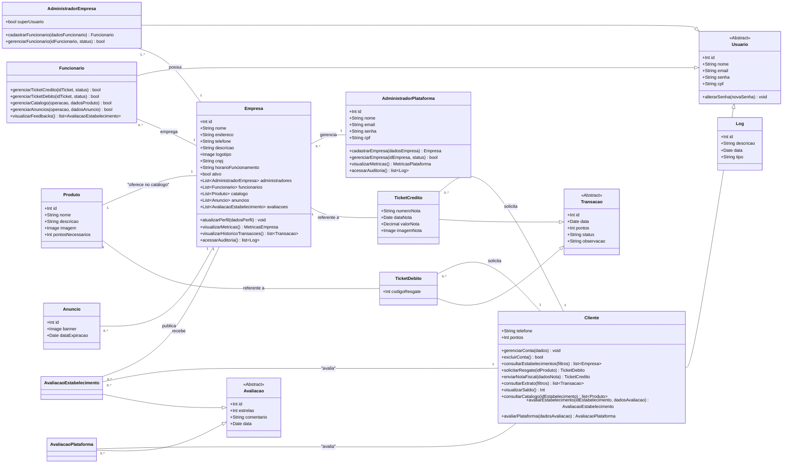

### Diagrama de Classes (Planejado)

```mermaid
classDiagram
    direction RL
    class AdministradorPlataforma {
        +Int id
        +String nome
        +String email
        +String senha
        +String cpf
        +cadastrarEmpresa(dadosEmpresa) Empresa
        +gerenciarEmpresa(idEmpresa, status) bool
        +visualizarMetricas() MetricasPlataforma
        +acessarAuditoria() list~Log~
    }
    class Empresa {
        +Int id
        +String nome
        +String endereco
        +String telefone
        +String descricao
        +Image logotipo
        +String cnpj
        +String horarioFuncionamento
        +bool ativo
        +List~AdministradorEmpresa~ administradores
        +List~Funcionario~ funcionarios
        +List~Produto~ catalogo
        +List~Anuncio~ anuncios
        +List~AvaliacaoEstabelecimento~ avaliacoes
        +atualizarPerfil(dadosPerfil) void
        +visualizarMetricas() MetricasEmpresa
        +visualizarHistoricoTransacoes() list~Transacao~
        +acessarAuditoria() list~Log~
    }
    class Usuario {
        <<Abstract>>
        +Int id
        +String nome
        +String email
        +String senha
        +String cpf
        +alterarSenha(novaSenha) void
    }
    class AdministradorEmpresa {
        +bool superUsuario
        +cadastrarFuncionario(dadosFuncionario) Funcionario
        +gerenciarFuncionario(idFuncionario, status) bool
    }
    class Funcionario {
        +gerenciarTicketCredito(idTicket, status) bool
        +gerenciarTicketDebito(idTicket, status) bool
        +gerenciarCatalogo(operacao, dadosProduto) bool
        +gerenciarAnuncios(operacao, dadosAnuncio) bool
        +visualizarFeedbacks() list~AvaliacaoEstabelecimento~
    }
    class Cliente {
        +String telefone
        +Int pontos
        +gerenciarConta(dados) void
        +excluirConta() bool
        +consultarEstabelecimentos(filtros) list~Empresa~
        +solicitarResgate(idProduto) TicketDebito
        +enviarNotaFiscal(dadosNota) TicketCredito
        +consultarExtrato(filtros) list~Transacao~
        +visualizarSaldo() Int
        +consultarCatalogo(idEstabelecimento) list~Produto~
        +avaliarEstabelecimento(idEstabelecimento, dadosAvaliacao) AvaliacaoEstabelecimento
        +avaliarPlataforma(dadosAvaliacao) AvaliacaoPlataforma
    }
    class Transacao {
        <<Abstract>>
        +Int id
        +Date data
        +Int pontos
        +String status
        +String observacao
    }
    class TicketCredito {
        +String numeroNota
        +Date dataNota
        +Decimal valorNota
        +Image imagemNota
    }
    class TicketDebito {
        +Int codigoResgate
    }
    class Produto {
        +Int id
        +String nome
        +String descricao
        +Image imagem
        +Int pontosNecessarios
    }
    class Avaliacao {
        <<Abstract>>
        +Int id
        +Int estrelas
        +String comentario
        +Date data
    }
    class AvaliacaoEstabelecimento
    class AvaliacaoPlataforma
    class Anuncio {
        +Int id
        +Image banner
        +Date dataExpiracao
    }
    class Log {
        +Int id
        +String descricao
        +Date data
        +String tipo
    }

    Usuario <|-- AdministradorEmpresa
    Usuario <|-- Funcionario
    Usuario <|-- Cliente

    AdministradorPlataforma "1" -- "0..*" Empresa : gerencia
    Empresa "1" -- "1..*" AdministradorEmpresa : possui
    Empresa "1" -- "0..*" Funcionario : emprega
    Empresa "1" -- "1" Produto : "oferece no catálogo"
    Empresa "1" -- "0..*" Anuncio : publica
    Empresa "1" -- "0..*" AvaliacaoEstabelecimento : recebe

    Cliente "1" -- "0..*" TicketCredito : solicita
    Cliente "1" -- "0..*" TicketDebito : solicita
    Cliente "1" -- "0..*" AvaliacaoEstabelecimento : "avalia"
    Cliente "1" -- "0..*" AvaliacaoPlataforma : "avalia"

    Transacao <|-- TicketCredito
    Transacao <|-- TicketDebito

    TicketCredito -- "1" Empresa : referente a
    TicketDebito -- "1" Produto : referente a

    Avaliacao <|-- AvaliacaoEstabelecimento
    Avaliacao <|-- AvaliacaoPlataforma
```
