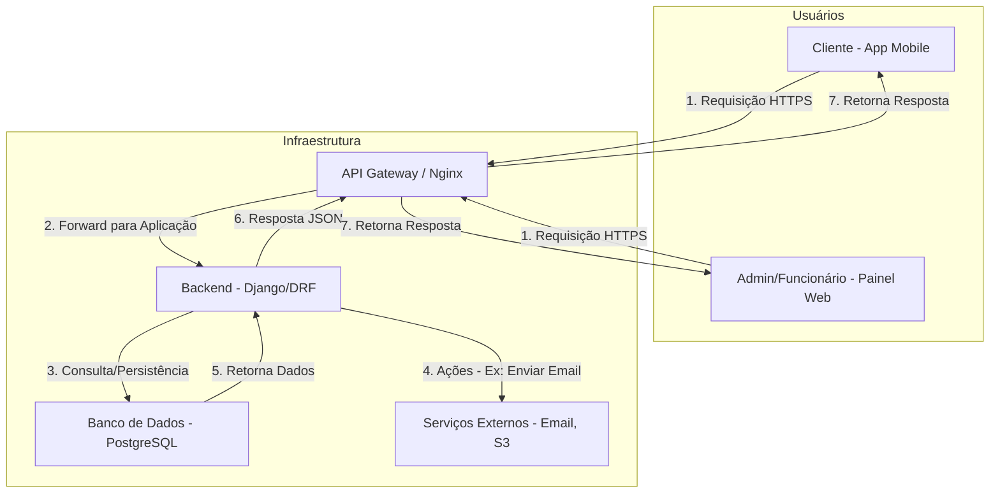
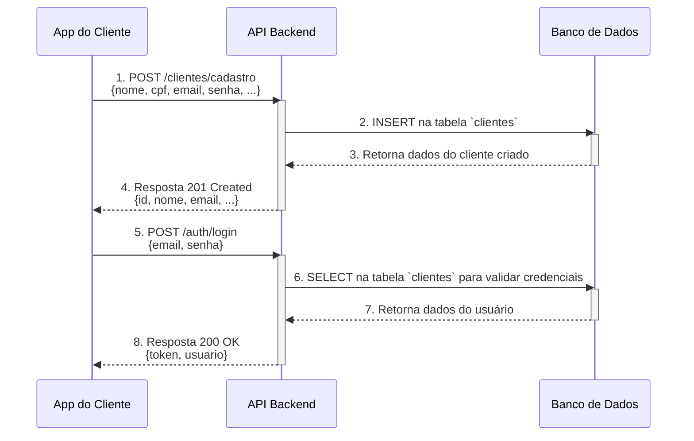
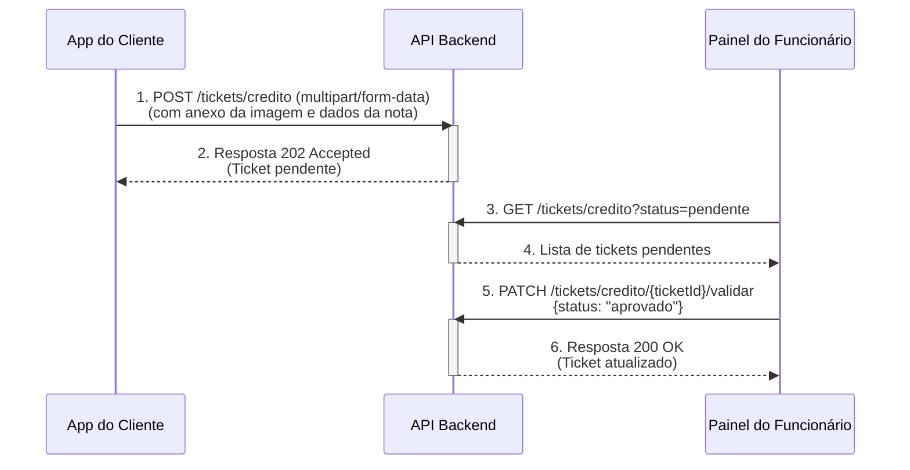
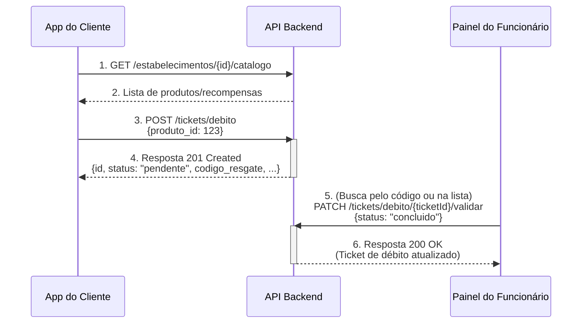
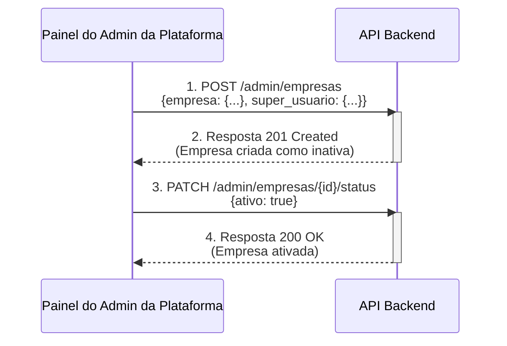

[Visão Geral](/README.md) | [Diagrama Entidade Relacionamento](/docs/diagram_er.md) | [Diagrama De Classes](/docs/diagrama_classes.md) | [Requisitos Funcionais e Não Funcionais](/docs/requisitos.md) | [Endpoints](/docs/endpoints.md)

---

### Fluxo de Requisição

#### Visão Geral da Interação

A comunicação entre os clientes (aplicativo mobile e painel web) e o servidor seguirá o padrão RESTful sobre HTTPS. A autorização para endpoints protegidos será feita através de um Bearer Token (JWT) enviado no cabeçalho `Authorization` de cada requisição.

##### Snippet de código

#### Fluxo 1: Cadastro de Cliente e Primeiro Acesso

Este fluxo descreve como um novo cliente se cadastra na plataforma e realiza seu primeiro login.

**Atores:** Cliente

##### Snippet de código

##### Passo a Passo:

1. **Requisição de Cadastro:** O cliente preenche seus dados no aplicativo. O app envia uma requisição `POST /clientes/cadastro`.

2. **Processamento no Backend:** A API recebe os dados, valida (ex: CPF e e-mail únicos) e, se tudo estiver correto, cria um novo registro na tabela `clientes`.

3. **Resposta de Sucesso:** A API retorna o status `201 Created` com os dados básicos do cliente recém-criado.

4. **Requisição de Login:** Após o cadastro, o cliente usa seu e-mail e senha para fazer login. O app envia uma requisição `POST /auth/login`.

5. **Autenticação e Geração de Token:** A API valida as credenciais contra o banco de dados. Se forem válidas, gera um token JWT.

6. **Retorno do Token:** A API responde com o status `200 OK`, enviando o token JWT e as informações do usuário. O aplicativo cliente deve armazenar este token de forma segura para usar em requisições futuras.

#### Fluxo 2: Cliente Acumulando Pontos (Envio de Nota Fiscal)

Este fluxo mostra a interação quando um cliente envia uma nota fiscal para acumular pontos.

**Atores:** Cliente, Funcionário do Estabelecimento

##### Snippet de código

##### Passo a Passo:

1. **Envio do Cliente:** O cliente, já autenticado, envia os dados e a imagem da nota fiscal através de uma requisição `POST /tickets/credito`. O corpo é do tipo `multipart/form-data`.

2. **Criação do Ticket:** O Backend cria um registro na tabela `ticket_credito` com o status "pendente" e responde `202 Accepted`, indicando que a solicitação foi recebida mas ainda não processada.

3. **Validação pelo Funcionário:** O funcionário do estabelecimento, através do seu painel web, busca por tickets pendentes (`GET /tickets/credito`).

4. **Aprovação/Recusa:** Após analisar a nota, o funcionário aprova ou recusa o ticket enviando uma requisição `PATCH /tickets/credito/{ticketId}/validar` com o status correspondente.

5. **Atualização no Backend:** A API atualiza o status do ticket. Se for "aprovado", o sistema calcula os pontos com base nas regras de negócio e os credita na conta do cliente, atualizando o campo `pontos` na tabela `clientes`.

#### Fluxo 3: Cliente Resgatando um Produto com Pontos

Este fluxo detalha o processo de um cliente utilizando seus pontos para resgatar uma recompensa.

**Atores:** Cliente, Funcionário do Estabelecimento

##### Snippet de código

##### Passo a Passo:

1. **Consulta ao Catálogo:** O cliente consulta os produtos disponíveis em um estabelecimento através da requisição `GET /estabelecimentos/{id}/catalogo`.

2. **Solicitação de Resgate:** Ao escolher um produto, o aplicativo envia uma `POST /tickets/debito` com o ID do produto.

3. **Processamento no Backend:** A API verifica se o cliente possui pontos suficientes. Em caso afirmativo, debita os pontos da conta do cliente e cria um registro na tabela `ticket_debito` com status "pendente" e um `codigo_resgate` único.

4. **Retorno do Código:** A API retorna `201 Created` com os detalhes do ticket, incluindo o `codigo_resgate` que o cliente deverá apresentar no estabelecimento.

5. **Validação do Resgate:** No local, o funcionário recebe o código do cliente, localiza o ticket em seu painel e o finaliza com uma requisição `PATCH /tickets/debito/{ticketId}/validar`, alterando o status para "concluido".

6. **Confirmação:** O Backend atualiza o status do ticket, efetivando o resgate.

#### Fluxo 4: Gestão de Empresas pelo Administrador da Plataforma

Este fluxo descreve como o administrador geral do sistema cadastra e ativa uma nova empresa parceira.

**Atores:** Admin da Plataforma

##### Snippet de código

##### Passo a Passo:

1. **Cadastro da Empresa:** O Admin da Plataforma envia os dados da nova empresa e de seu administrador (superusuário) através de uma `POST /admin/empresas`.

2. **Criação no Backend:** A API cria o registro do estabelecimento na tabela `estabelecimentos` (com `ativo = false`) e o registro do administrador na tabela `administradores`, associando-os. Uma senha temporária é gerada para o superusuário.

3. **Ativação da Empresa:** Para que a empresa apareça publicamente, o Admin da Plataforma envia uma requisição `PATCH /admin/empresas/{id}/status` para mudar o campo `ativo` para `true`.

4. **Confirmação:** A API atualiza o status da empresa e retorna `200 OK`. Agora o estabelecimento está visível para os clientes e seu administrador pode acessar o painel web.
